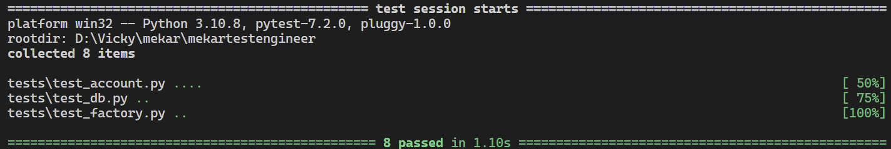

# Mekar Test Engineer
Mekar Test Engineer adalah sebuah aplikasi REST API yang dibuat menggunakan Python.


## Table of Contents
- [mekar-app](#mekar-app)
  - [Table of Contents](#table-of-contents)
  - [Installation](#installation)
  - [REST API](#rest-api)
    - [Check Saldo](#check-saldo)
      - [Request](#request)
      - [Response](#response)
    - [Transfer](#transfer)
      - [Request](#request-1)
      - [Response](#response-1)
  - [Unit Test](#unit-test)


## Installation
Pastikan sudah install pada desktop anda [docker](https://www.docker.com/)

Clone repository [ini](https://github.com/vickyindahwati/mekartestengineer.git) kemudian buka terminal dan masuk ke dalam directory ``mekartestengineer``
```bash
~ $ cd mekartestengineer
```

Jalankan perintah pada terminal anda
```bash
~/mekartestengineer $ docker-compose -f docker-compose.yml up --build
```

tunggu sampai proses download dan build selesai. Jika sudah selesai pada terminal anda akan menampilkan seperti berikut
```bash
mekar | [2022-11-05 00:26:30,878] INFO in serve: Serving at http://0.0.0.0:5000
```

## REST API
Berikut adalah REST API yang ada pada mekartestengineer


### Check Saldo
berfungsi untuk melakukan check saldo user

#### Request
`GET /account/<account_number>`

Parameter | Type | Required | Description
--- | --- | :---: | ---
account_number | string | √ | account number yang ingin melakukan check saldo

```bash
curl --location --request GET '127.0.0.1:5000/account/555002' --header 'Content-Type: application/json'
```

#### Response
```bash
HTTP/1.1 200 OK
Content-Type: application/json
Content-Length: 72
Date: Sat, 05 Nov 2022 00:33:31 GMT
```
```json
{
    "account_number": "555001",
    "balance": 10000,
    "customer_name":"Bob Martin"
}
```

### Transfer

#### Request
`POST /account/<from_account_number>/transfer`

Parameter | Type | Required | Description
--- | --- | :---: | ---
from_account_number| string | √ | account number yang melakukan transfer

Body - JSON
```json
{
    "to_account_number": "555002",
    "amount": 10
}
```

Field | Type | Required | Description
--- | --- | :---: | ---
to_account_number | string | √ | account number yang dituju
amount | integer | √ | jumlah saldo yang dikirimkan


```bash
curl -i --location --request POST '127.0.0.1:5000/account/555001/transfer' --header 'Content-Type: application/json' --data-raw '{"to_account_number":"555002","amount":2000}'
```

#### Response
```bash
HTTP/1.1 200 OK
Content-Type: application/json
Content-Length: 72
Date: Sat, 05 Nov 2022 00:33:31 GMT
```

## Unit Test
Untuk menjalankan unit test, buka terminal dan masukkan perintah sbb :
```bash
mekartestengineer $ docker exec mekar pytest tests/
```

Berikut adalah hasil dari unit test :

